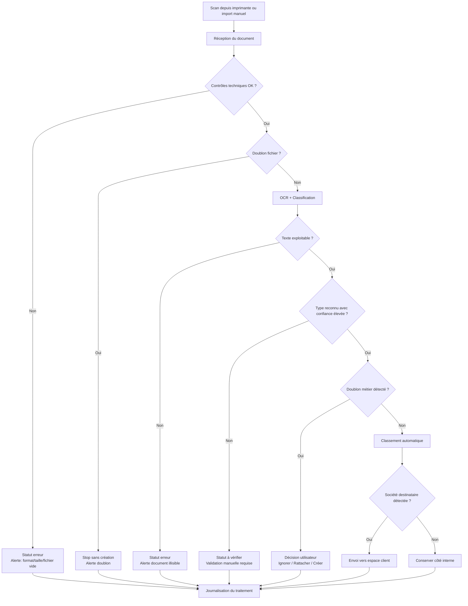

# Gestion des Amendes — SaaS Next.js

SaaS local pour scanner et gérer les avis de contravention d'une flotte de véhicules. Reproduit les feuilles Excel d'origine (Tableau de bord, Véhicules, Conducteurs, Contraventions) **sans Excel**.

## Stack

- **Next.js 15** (App Router) + TypeScript
- **pnpm** comme gestionnaire de paquets
- **Prisma + SQLite** (base de données locale `prisma/dev.db`)
- **Tailwind CSS v4**
- **Tesseract.js** (OCR français, 100 % côté client, aucun cloud)
- **ExcelJS** pour ré-exporter au format `.xlsx`

## Démarrage

```bash
pnpm install
pnpm prisma migrate dev --name init
pnpm db:seed         # crée 4 véhicules + 3 conducteurs d'exemple
pnpm dev
```

Ouvre http://localhost:3000.

## Fonctionnalités

- **Multi-sociétés** : chaque véhicule, conducteur et contravention est rattaché à une société (champ `societe`) pour centraliser plusieurs entités dans la même application.
- **Tableau de bord** : KPI (total, à dénoncer, en attente, montant), alertes dénonciations urgentes (< 45 j) et retards de paiement.
- **Scanner une amende** : drag-and-drop d'une photo/scan → OCR français → extraction automatique (n° avis, date, heure, lieu, immatriculation, nature, montant, vitesses) via [src/lib/fine-parser.ts](src/lib/fine-parser.ts) → formulaire pré-rempli → enregistrement.
- **Contraventions** : liste filtrable, fiche détaillée (dénonciation + paiement), édition, suppression.
- **Véhicules / Conducteurs** : CRUD complet, rattachement automatique à l'immatriculation détectée par l'OCR.
- **Export Excel** (`/api/export`) : génère un classeur identique en structure à l'original (3 feuilles + tableau de bord).

## Diagramme de décision (scan document)



## Architecture

```
src/
  app/
    page.tsx                       # Dashboard
    contraventions/
      page.tsx                     # liste
      new/page.tsx                 # saisie manuelle
      scan/{page,ScanClient}.tsx   # scan OCR
      [id]/page.tsx                # édition
      actions.ts                   # server actions
    vehicules/{page,actions}.tsx
    conducteurs/{page,actions}.tsx
    api/export/route.ts            # XLSX
  components/ContraventionForm.tsx
  lib/{prisma,utils,fine-parser}.ts
prisma/{schema.prisma,seed.ts}
```

## Notes

- L'OCR tourne dans le navigateur ; la première analyse télécharge le modèle FR (~10 Mo), puis tout est instantané.
- Le parseur (`fine-parser.ts`) reconnaît les avis ANTAI standards (excès de vitesse, stationnement, péage, feu rouge, etc.). Les regex sont facilement ajustables.
- Pour passer en multi-utilisateur, remplacer SQLite par Postgres dans [prisma/schema.prisma](prisma/schema.prisma) et ajouter NextAuth.
